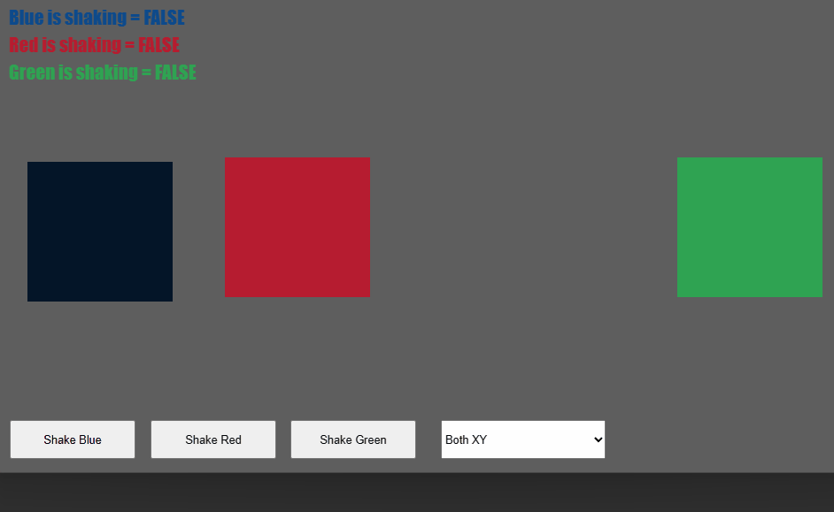

<br>
# Shake <br>
A Behavior that shakes the object, for Construct 3. <br>
<br>
Author: piranha305 <br>
Website: https://piranha305.itch.io/ <br>
Download Latest Version : [Version: 1.0.0.0](https://github.com/armandoalonso/shake/releases/latest) <br>
<sub>Made using [c3ide2-framework](https://github.com/ConstructFund/c3ide2-framework) </sub><br>

## Table of Contents
- [Usage](#usage)
- [Examples Files](#examples-files)
- [Properties](#properties)
- [Actions](#actions)
- [Conditions](#conditions)
- [Expressions](#expressions)
---
## Usage
To build the addon, run the following commands:

```
npm i
node ./build.js
```

To run the dev server, run

```
npm i
node ./dev.js
```

The build uses the pluginConfig file to generate everything else.
The main files you may want to look at would be instance.js and scriptInterface.js

## Examples Files
- [piranha305_shake_examples](./examples/piranha305_shake_examples.c3p)
</br>

</br>

---
## Properties
| Property Name | Description
| --- | --- |
| [Enabled](#enabled) | Enable or disable the shake behavior. |
| [Duration](#duration) | Duration of the shake in seconds. |
| [Magnitude](#magnitude) | Magnitude of the shake. |
| [Magnitude Mode](#magnitude-mode) | Magnitude mode. (Select if the magnitude is constant or decays over time) |
| [Shake Axis](#shake-axis) | Shake axis. (Select which axis to offset) |
---
### Enabled
**Description:** <br> Enable or disable the shake behavior. </br>
**Type:** <br> check
### Duration
**Description:** <br> Duration of the shake in seconds. </br>
**Type:** <br> float
### Magnitude
**Description:** <br> Magnitude of the shake. </br>
**Type:** <br> float
### Magnitude Mode
**Description:** <br> Magnitude mode. (Select if the magnitude is constant or decays over time) </br>
**Type:** <br> combo
**Options:**
- constant: Constant
- decay: Decay
### Shake Axis
**Description:** <br> Shake axis. (Select which axis to offset) </br>
**Type:** <br> combo
**Options:**
- xy: Shake XY Axis
- x: Shake Only X Axis
- y: Shake Only Y Axis

---
## Actions
| Action | Description |
| --- | --- |
| [Enable](#enable) | Enable the behavior. |
| [Start Shake](#start-shake) | Start the shake. |
| [Stop Shake](#stop-shake) | Stop the shake. |
| [Set Duration](#set-duration) | Set the duration of the shake. |
| [Set Magnitude](#set-magnitude) | Set the magnitude of the shake. |
| [Set Magnitude Mode](#set-magnitude-mode) | Set the magnitude mode of the shake. (Select if the magnitude is constant or decays over time) |
| [Set Shake Axis](#set-shake-axis) | Set the axis of the shake. |
---
### Enable
**Description:** <br> Enable the behavior. </br>
#### Parameters:
| Name | Type | Description |
| --- | --- | --- |
| Enabled | boolean | Enable or disable the shake behavior. |
### Start Shake
**Description:** <br> Start the shake. </br>
### Stop Shake
**Description:** <br> Stop the shake. </br>
### Set Duration
**Description:** <br> Set the duration of the shake. </br>
#### Parameters:
| Name | Type | Description |
| --- | --- | --- |
| Duration | number | Duration of the shake in seconds. |
### Set Magnitude
**Description:** <br> Set the magnitude of the shake. </br>
#### Parameters:
| Name | Type | Description |
| --- | --- | --- |
| Magnitude | number | Magnitude of the shake. |
### Set Magnitude Mode
**Description:** <br> Set the magnitude mode of the shake. (Select if the magnitude is constant or decays over time) </br>
#### Parameters:
| Name | Type | Description |
| --- | --- | --- |
| Magnitude Mode | combo | Magnitude mode. |
### Set Shake Axis
**Description:** <br> Set the axis of the shake. </br>
#### Parameters:
| Name | Type | Description |
| --- | --- | --- |
| Shake Axis | combo | Shake axis. |

---
## Conditions
| Condition | Description |
| --- | --- |
| [On Shake End](#on-shake-end) | Triggered when the shake ends. |
| [Is Shaking](#is-shaking) | Check if the shake is in progress. |
---
### On Shake End
**Description:** <br> Triggered when the shake ends. </br>
**Is Trigger:** <br> true </br>
### Is Shaking
**Description:** <br> Check if the shake is in progress. </br>

---
## Expressions
| Expression | Description |
| --- | --- |
| [Duration](#duration) | Get the duration of the shake. |
| [RemainingDuration](#remainingduration) | Get the remaining duration of the shake. |
| [OriginX](#originx) | Get the origin X of the shake. |
| [OriginY](#originy) | Get the origin Y of the shake. |
---
### Duration
**Description:** <br> Get the duration of the shake. </br>
**Return Type:** <br> number </br>
### RemainingDuration
**Description:** <br> Get the remaining duration of the shake. </br>
**Return Type:** <br> number </br>
### OriginX
**Description:** <br> Get the origin X of the shake. </br>
**Return Type:** <br> number </br>
### OriginY
**Description:** <br> Get the origin Y of the shake. </br>
**Return Type:** <br> number </br>